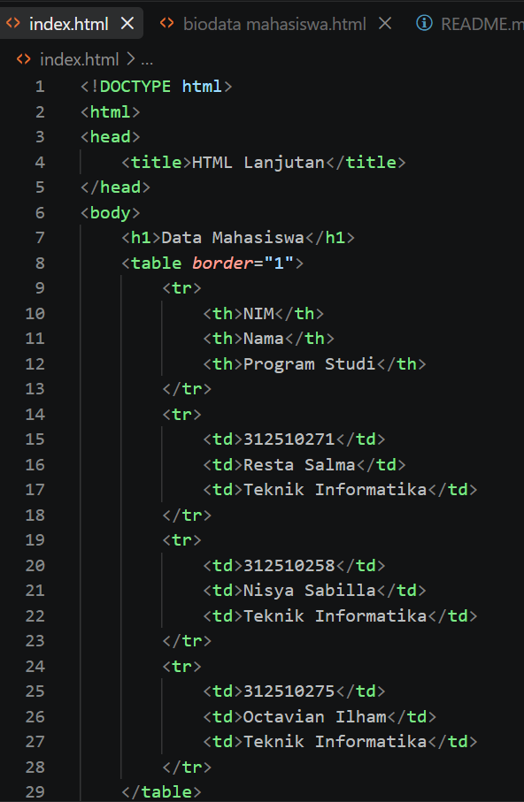

## Praktikum 1 : HTML Dasar Lanjutan ##

Berikut hasil praktikum saya pada praktikum 1 : HTML dasar Lanjutan

## 1. Membuat Tabel Data Mahasiswa
Membuat dokumen HTML dengan title HTML Lanjutan, pada body membuat judul dengan heading 1 "Data Mahasiswa"
Untuk membuat tabel menggunakan elemen < table >, lalu menggunakan elemen < tr > untuk membuat baris, elemen < th > untuk membuat sel deader, dan elemen < td > untuk membuat sel data

## 2. Mengembangkan Tabel dengan thead, tbody, dan tfoot
Menggunakan elemen < table >, lalu menambhakna judul tabel menggunakan < caption >. < thead > digunakan untuk tabel bagian kepala atau atasnya, < tbody > digunakan untuk tabel bagian body atau tengah-tengah, dan < tfoot > digunakan untuk tabel bagian kaki atau bawah

## 3. Membuat Form Registrasi Mahasiswa
Elemen < form > digunakan untuk container untuk kelompok input, seperti menginput registrasi mahasiswa diperlukan nama, email, password, dan juga tanggal lahir. Lalu di submit dengan elemen < button >

## 4. Radio Button dan Checkbox
Membuat pilihan dengan menggunakan radio button, jadi kita memilih 1 pada pilihan disitu. Elemen yang digunakan < input type="radio">. Sedangkan checkbox itu bisa memilih lebih dari 1. Elemen yang digunakan < input type="checkbox" >

## 5. Select dan Textarea
Select dan textarea digunakan untuk memilih dalam suatu tombol, jadi pada saat dipencet maka ada beberapa opsi lain dalam tombol tersebut.

## 6. Validasi Form Dasar
Validasi form dasar itu membuat form dan juga mengingatkan jika ada form yang belum diisi.

## 7. Membuat Halaman Semantic HTML
Digunakan untuk menuju yang dituju, jadi tulisan yang dipilih itu akan menuju link yang dituju. Selain itu, membuat artikel dan juga aside untuk tulisan kecil seperti informasi tambahan

## 8. Menambahkan Multimedia
Untuk menambahkan audio dan video menggunakan elemen < audio > dan < video >. Membuat file dan memasukkan audio dan video yang diinginkan, dan mencari nya dengan elemen < source src="file/audio.mp3 atau video.mp4>

## 9. Menggabungkan semua tag yang telah dipraktekkan ke satu form biodata mahasiswa.html

